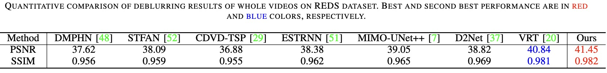

# Aggregating Long-term Sharp Features via Hybrid Transformers for Video Deblurring
Under Review
---
### Introduction


## Prerequisites
- Python >= 3.6, PyTorch >= 1.1.0
- Requirements: opencv-python, numpy, matplotlib, imageio, scikit-image, tqdm
- Platforms: Ubuntu 20.04, cuda-10.2, 4 * Tesla V100 (16GB)

## Datasets
  GOPRO_Random([Original](https://seungjunnah.github.io/Datasets/gopro.html)): To satisfy our assumption that sharp frames exist in a blurry video, we generate non-consecutively blurry frames in a video by randomly averaging adjacent sharp frames, i.e., the average number is randomly chosen from 1 to 15. And we assume that a generated frame **Bi** is sharp if the number of averaging frames is smaller than 5, i.e., label is 1, otherwise label is 0. It is worth noting that we randomly generate 50% blurry frames in a video, while the other 50% frames are sharp, without constraining that there must be 2 sharp ones in consecutive 7 frame.

  REDS_Random([Original](https://seungjunnah.github.io/Datasets/reds.html)): To satisfy our assumption that sharp frames exist in a blurry video, we generate non-consecutively blurry frames
in the same way as GOPRO. However, when the frame rate is not high enough, simply averaging frames may generate unnatural spikes or steps in the blur trajectory, especially when the resolution is high and the motion is fast. Hence, we employed [FLAVR](https://github.com/tarun005/FLAVR) to interpolate frames, increasing the frame rate to virtual 960 fps by recursively interpolating the frames. Thus, we can synthesize frames with different degrees of blur, i.e., the average number is randomly chosen from 3 to 39. And we assume that a generated frame **Bi** is sharp if the number of averaging frames is smaller than 17, i.e., label is 1, otherwise label is 0.

### Dataset Organization Form
```
|--dataset
    |--blur  
        |--video 1
            |--frame 1
            |--frame 2
                ：  
        |--video 2
            :
        |--video n
    |--gt
        |--video 1
            |--frame 1
            |--frame 2
                ：  
        |--video 2
         :
        |--video n
    |--Event
        |--video 1
            |--frame 1
            |--frame 2
                ：  
        |--video 2
         :
        |--video n
    |--label
        |--video 1
        |--video 2
         :
        |--video n
```
  BSD Dataset: [ESTRNN](https://github.com/zzh-tech/ESTRNN) provided a real-world video blur dataset by using a beam splitter system with two synchronized cameras. By controlling the length of exposure time and strength of exposure intensity during video shooting, the system could obtain a pair of sharp and blurry video samples by shooting video one time. They collected blurry/sharp video sequences for three different blur intensity settings (sharp exposure time – blurry exposure time), 1ms–8ms, 2ms–16ms and 3ms–24ms, respectively. The test set has 20 video sequences with 150 frames in each intensity
setting. We use these test sets for evaluating generalization ability.

  CED Dataset: [Scheerlinck et al.](https://rpg.ifi.uzh.ch/CED.html) presented the first Color Event Camera Dataset (CED) by color event camera ColorDAVIS346, containing 50 minutes of footage with both color frames and events. We also employed FLAVR to interpolate frames for generating blurry frames as the same with REDS. We randomly split the sequences in CED into training, validation and testing sets, and report the corresponding comparison results against the state-of-the-art models by retraining them with the same setting in extension experiment.

  RBE Dataset: [Pan et al.](https://github.com/panpanfei/Bringing-a-Blurry-Frame-Alive-at-High-Frame-Rate-with-an-Event-Camera) presented a real blurry event dataset, where each real sequence is captured with the DAVIS under different conditions, such as indoor, outdoor scenery, low lighting conditions, and different motion patterns (e.g., camera shake, objects motion) that naturally introduce motion blur into the APS intensity images. There is no ground-truth data available on this dataset. Hence, we only use it for quantitative comparison.

## Download
Please download the testing datasets and training datasets from [BaiduYun](https://pan.baidu.com/s/1ojshRp47aF61eKi3cpN_0Q)[password:f94f]. Our STGTN model trained on non-consecutively blurry GOPRO dataset, REDS dataset, event dataset can be download [Here](https://pan.baidu.com/s/1lHu0SH_fgeEe-U4CU-CtRA)[password:8qpa]. Our results on all datasets can be download [Here](https://pan.baidu.com/s/1-mNK2bHmBj75pg2-h99cDQ)[password:9jzx].

_(i)  If you have downloaded the pretrained models，please put STGTN model to './experiment'._

_(ii) If you have downloaded the datasets，please put them to './dataset'._

## Getting Started

### 1) Testing
```
cd code
```
① _For testing w/o event data :_
```
python inference_swin_hsa_nfs.py --default_data XXXX
```
② _For testing w/ event data :_

_On synthetic event dataset:_
```
inference_swin_hsa_nfs_event.py
```
_On real event dataset:_
```
inference_swin_hsa_nfs_event_real.py
```

### Results
Metrics(PSNR/SSIM) calculating codes are [Here](https://github.com/csbhr/OpenUtility#chapter-calculating-metrics).

Average PSNR/SSIM values on GOPRO_Random dataset:


Average PSNR/SSIM values on REDS_Random dataset:




Average PSNR/SSIM values on BSD dataset:


Average PSNR/SSIM values on CED dataset:


Results on RBE dataset:


### Ablation
Component Analysis:


Effectiveness of NSFs:


### 2) Training
Without event data:
```
python main_d2net.py --template D2NET
```
With event data:
```
python main_d2net_event.py --template D2NET_EVENT
```
Please check the path for you dataset.


## Cite
If you use any part of our code, or D2Net and non consecutively blurry dataset are useful for your research, please consider citing:
```
  @InProceedings{Shang_2021_ICCV,
      author    = {Shang, Wei and Ren, Dongwei and Zou, Dongqing and Ren, Jimmy S. and Luo, Ping and Zuo, Wangmeng},
      title     = {Bringing Events Into Video Deblurring With Non-Consecutively Blurry Frames},
      booktitle = {Proceedings of the IEEE/CVF International Conference on Computer Vision (ICCV)},
      month     = {October},
      year      = {2021},
      pages     = {4531-4540}
  }
```


